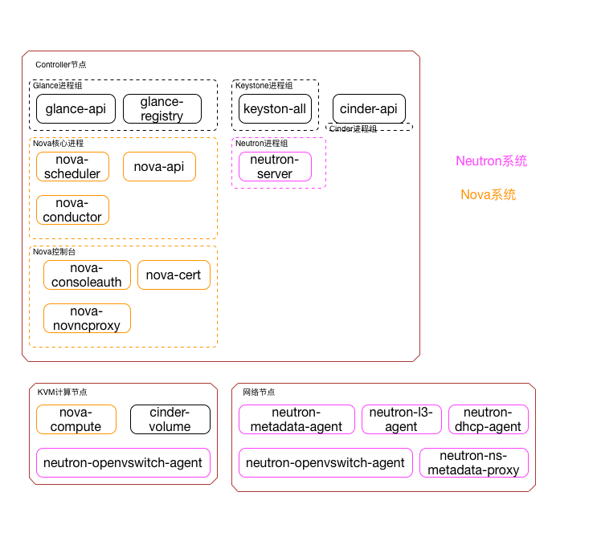

# OpenStack生存指南

在安装和使用OpenStack的过程中我们总是会碰到各种各样的问题，如果想解决这些问题我们首先必须搞清楚OpenStack各个组件的关系。这里我画了一幅图，用来表达OpenStack中各个进程和所在的节点（部署的情况不一样所以你的环境下可能和我的图不太一样，注意区分一下）

核心组件包括keystone，nova，neutron，glance，cinder也勉强算核心（没有cinder可以正常使用，只是云硬盘的功能缺失）。

##Controller节点
Controller节点上的进程主要负责各个模块的API、管理、调度
###keystone
keystone没有做任何进程切分，所以它只有一个进程——keystonall
###glance
glance的进程被拆分:
* glance-api负责API和存储镜像，它收到用户请求之后转发给registry完成数据库操作。（通过HTTP接口而不是MQ接口，OpenStack所有的内部通讯都是MQ，这个是特例。我也不知道为什么。。。）如果有上传或者下载Image，该进程会负责写入和读取；
* glance-registry只是负责读写数据库，完成元数据操作(记录镜像的名字、上传时间等数据)；
###nova
nova的进程被拆分为：
* nova-api，提供nova的api
* nova-consoleauth、nova-cert、nova-nonvcproxy是负责VNC控制台的，consoleauth负责控制台身份认证的，cert是nova下发元数据的证书管理(新建之后的虚拟机可以自动执行某一段脚本，这个功能被称为mate)，nonvcproxy支持HTML5的VNC控制台。
* nova-scheduler，虚拟机开通的时候nova需要为它选择一台“合适”的计算节点，这个过程被称为调度。这部分工作被隔离为nova-scheduler进程
* nova-conductor，nova-compute被设为不依赖任何数据库，当它需要数据库操作的时候（比如更新虚拟机状态）通过MQ发送消息给nova-conductor由它完成实际的数据库操作。nova的这个设计彻底解耦了计算节点的依赖关系，使计算节点只依赖MQ，可以任意移除，新增。
###neutron
neutron的进程被拆分为：
neutron-server，neutron-server是负责neutron的API，转换成内部的调用通过MQ下发给ovs-agent、L3、DHCP、matedate。
###cinder
* cinder-api，提供cinder的api

##Compute节点
###nova
* nova-compute，响应MQ中的消息，调用KVM开通虚拟机。发送消息到MQ，更新虚拟机状态。
###neutron
* ovs-agent，响应MQ中的消息，调用OVS的接口开通桥接器、网络端口，它下发涉及访问虚拟机之间流量的时候OpenFlow到OVS桥接器
###cinder
* cinder-volume，响应MQ中的消息，调用后端存储的API划分存储

##Network节点
###neutorn
这个节点只有neutron进程
* neutron-matedata-agent，matedata可以实现虚拟机启动之后自动执行一段脚本。这个功能被称为matedata。
* neutron-l3-agent，L3路由器
* neutron-dhcp-agent，dhcp服务器
* ovs-agent，响应MQ中的消息，调用OVS的接口开通桥接器、网络端口。它下发涉及访问外网的时候OpenFlow到OVS桥接器
